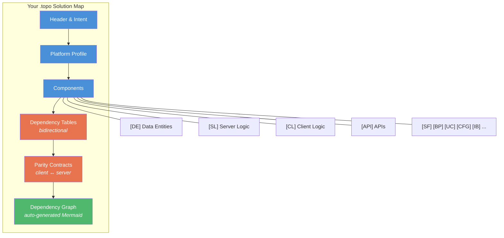

<p align="center">
  <h1 align="center">ToPO</h1>
  <p align="center"><strong>Topological Platform Ontology</strong></p>
  <p align="center">
    A platform-agnostic architecture description language<br/>
    expressed as structured markdown.
  </p>
  <p align="center">
    
    
    
    
  </p>
</p>

---

## What is ToPO?

ToPO is a structured markdown format (`.topo` files) for documenting software architecture — specifically the **wiring** between components: what depends on what, what breaks if something changes, and why each piece exists.

Most architecture docs are either visual-first (C4, ArchiMate, UML) and hard for AI agents to consume, or scattered across code comments and wikis. ToPO gives you a **single living document** that both humans and AI agents read before making changes — version-controlled, diffable, and platform-agnostic.

You create a solution map, define your platform profile (mapping abstract types to your stack), then maintain it as you build. **11 component types, 10 typed relationships, bidirectional dependency tracking, and parity contracts** — all in plain markdown.

---

## Five Questions ToPO Answers

> **1.** Why does each component exist?
>
> **2.** What does it depend on?
>
> **3.** What breaks if it changes?
>
> **4.** Where does it connect to external systems?
>
> **5.** What invariants must hold across client and server?

---

## How It Works



---

## Quick Start

**1. Install ToPO into your project**

Copy the ToPO files into your project. See [TOPO.md](TOPO.md) for the recommended file layout and full installation guide.

**2. Create your solution map**

```bash
cp templates/solution-map.topo docs/solution-map.topo
```

Fill in the header, solution intent, platform profile, and architectural rules.

**3. Start building**

Every time you create or modify a component, update the `.topo` map following the relevant [SOP](spec/topo-standard-operating-procedures.md). The golden rule: **update both sides of every dependency**.

---

## Component Types

| Tag | Type | What it represents |
|-----|------|--------------------|
| `[DE]` | Data Entity | Table, collection, document — persistent data |
| `[DF]` | Data Field | A field that drives logic (not every field — only logic-driving ones) |
| `[DR]` | Data Relationship | Structural link between entities |
| `[SL]` | Server Logic | Business rules executing server-side |
| `[CL]` | Client Logic | Logic executing in the user's environment |
| `[API]` | API | Exposed integration contract |
| `[SF]` | Shared Function | Reusable logic called by multiple components |
| `[BP]` | Background Process | Async or scheduled work |
| `[UC]` | UI Control | Custom UI component |
| `[CFG]` | Config Pattern | Configuration entity + generic handler |
| `[IB]` | Integration Boundary | Edge connecting to an external system |

## Relationship Types

| Type | Meaning | Impact if target changes |
|------|---------|--------------------------|
| `depends_on` | A requires B | B's failure breaks A |
| `serves` | A provides to B | A's interface change may break B |
| `triggers` | A causes B to run | A's changes affect B |
| `flows_to` | Data moves A → B | A's schema may break B |
| `realizes` | A implements B | B's contract change requires A update |
| `configures` | A provides config to B | A's schema affects B |
| `contains` | B is part of A | B's change always impacts A |
| `subscribes_to` | A listens to B | B's event schema affects A |
| `maps_to` | Abstract → concrete | Platform profile mapping |
| `supersedes` | A replaces B | B's dependents should migrate |

---

## Repository Structure

```
topo/
├── README.md                    ← You are here
├── TOPO.md                      ← Entry point & installation guide
├── LICENSE                      ← Apache 2.0
│
├── spec/                        ← Normative reference
│   ├── topo-language-spec.md         Full formal specification
│   └── topo-standard-operating-procedures.md
│                                     14 SOPs for every update scenario
│
├── guides/                      ← How-to documentation
│   ├── topo-integration-guide.md     Framework integration patterns
│   └── SKILL.md                      AI agent quick reference
│
├── commands/                    ← Command definitions
│   ├── topo-validate.md              Validation command (11 checks)
│   └── topo-update.md                Interactive add/modify/remove
│
├── rules/                       ← Enforcement rules
│   └── topo-maintenance.md           Mandatory update trigger
│
├── templates/                   ← Starting points
│   └── solution-map.topo             Blank template — copy this
│
└── examples/                    ← Worked demonstrations
    └── solution-map-shopping-list.topo
                                      Complete example (smart shopping list)
```

---

## Documentation

| Document | Purpose | When to read |
|----------|---------|--------------|
| [TOPO.md](TOPO.md) | Entry point, installation guide, platform profiles | First time setup |
| [Language Spec](spec/topo-language-spec.md) | Full specification — types, relationships, formats | Writing or reviewing `.topo` blocks |
| [SOPs](spec/topo-standard-operating-procedures.md) | Step-by-step for every update scenario | Adding, modifying, or removing components |
| [Integration Guide](guides/topo-integration-guide.md) | Embedding ToPO into dev frameworks | Setting up agent integrations |
| [SKILL.md](guides/SKILL.md) | AI agent operating manual | AI agents read this automatically |
| [/topo-validate](commands/topo-validate.md) | Consistency check command | Running validation |
| [/topo-update](commands/topo-update.md) | Interactive add/modify/remove | Using the update command |
| [Template](templates/solution-map.topo) | Blank solution map | Starting a new project |
| [Example](examples/solution-map-shopping-list.topo) | Complete worked example | Learning by example |

---

## For AI Agents

If you are an AI agent and encounter a `.topo` file or are asked to work with ToPO:

1. **Read [`guides/SKILL.md`](guides/SKILL.md)** — your operating manual with quick-reference tables
2. **Read the solution map** (`docs/solution-map.topo` in the target project) — understand the current architecture before making changes
3. **Follow the update contracts** — the bidirectional dependency rule is non-negotiable
4. **Use the [SOPs](spec/topo-standard-operating-procedures.md)** — step-by-step procedures for every scenario

See the [Integration Guide](guides/topo-integration-guide.md) for framework-specific setup (Claude Code, Cursor, Copilot, and others).

---

## How ToPO Compares

| Feature | ToPO | C4 | ArchiMate | UML |
|---------|------|-----|-----------|-----|
| **Format** | Markdown | Visual | Visual | Visual |
| **AI-native** | Yes | No | No | No |
| **Typed dependencies** | Yes (10 types) | No | Yes | Partial |
| **Bidirectional tracking** | Mandatory | No | Optional | No |
| **Platform profiles** | Yes | No | Yes (ABB/SBB) | No |
| **Parity contracts** | Yes | No | No | No |
| **Version control** | Native (markdown) | External | External | External |
| **Diffable** | Yes | No | No | No |

---

## Editor Setup

ToPO documents use the `.topo` extension. They are valid markdown — any renderer can display them.

| Editor | How to associate |
|--------|------------------|
| **VS Code** | `"files.associations": { "*.topo": "markdown" }` in settings.json |
| **JetBrains** | Settings → Editor → File Types → Markdown → Add `*.topo` |
| **Vim/Neovim** | `autocmd BufRead,BufNewFile *.topo set filetype=markdown` |
| **GitHub** | Already handled by `.gitattributes` in this repo |

---

## License

ToPO is licensed under the [Apache License 2.0](LICENSE).

Designed by Keith Whatling, developed in collaboration with Claude (Anthropic). ToPO draws on concepts from ArchiMate, TOGAF, C4 Model, OntoUML, Dublin Core, SPDX, CycloneDX, and OAM.

## Contributing

ToPO is in **draft** status. Feedback, suggestions, and contributions are welcome — please [open an issue](https://github.com/KeithWhatling/ToPO/issues).
